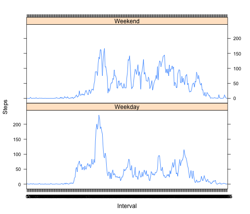

Peer Assignment 1 - Reproducible Research
========================================================

Set Echo = TRUE as a global option.

'''{r setoptions, echo = TRUE}

opts_chunk$set(echo = TRUE)

'''

Load the data from the working directory, create factor based on the date column and create new data sets that (1) aggregate steps by date and (2) gives the mean daily steps by interval.


```r
data <- read.csv("activity.csv", header = TRUE)

data$date <- factor(data$date)
day <- aggregate(data$steps, by = list(Category = data$date), FUN = sum, na.rm = TRUE)
colnames(day) <- c("Date", "Steps")

data$interval <- factor(data$interval)
interval <- aggregate(data$steps, by = list(Category = data$interval), FUN = mean, 
    na.rm = TRUE)
colnames(interval) <- c("Interval", "Steps")
```


Display a histogram of the total number of steps taken each day.


```r
hist(day$Steps, main = "Total Number of Steps Taken Per Day", xlab = "Number of Steps")
```

 


Calculate the mean and median total number of steps taken each day.


```r
mean(day$Steps)
```

```
## [1] 9354
```

```r
median(day$Steps)
```

```
## [1] 10395
```


Time-series plot of the average number of step taken, averaged across all days.


```r
plot(interval$Interval, interval$Steps, type = "l", main = "Average Number of Steps Per Interval, Averaged Across All Days", 
    xlab = "5-Minute Interval", ylab = "Average Number of Steps")
```

 


Determine the 5-minute interval, on average across all the days in the dataset, contains the maximum number of steps.


```r
as.numeric(toString(interval$Interval[interval$Steps == max(interval$Steps)]))
```

```
## [1] 835
```


Calculate and report the total number of missing values in the dataset (i.e. the total number of rows with NAs).


```r
sum(!complete.cases(data))
```

```
## [1] 2304
```


Devise a strategy for filling in all of the missing values in the dataset. The strategy does not need to be sophisticated. For example, you could use the mean/median for that day, or the mean for that 5-minute interval, etc.

The strategy used for imputing the missing data is to use the mean for the corresponding interval.

Create a new data set with the missing data filled in.


```r
new.data <- data
merge <- merge(interval, data)
indices <- which(is.na(new.data$steps))
new.data$steps[indices] <- merge$Steps[indices]
```


Make a histogram of the total number of steps taken each day and Calculate and report the mean and median total number of steps taken per day. 


```r
new.data$date <- factor(new.data$date)
new.day <- aggregate(new.data$steps, by = list(Category = new.data$date), FUN = sum, 
    na.rm = TRUE)
colnames(new.day) <- c("Date", "Steps")
hist(new.day$Steps, main = "Total Number of Steps Taken Per Day", xlab = "Number of Steps")
```

 


```r
mean(new.day$Steps)
```

```
## [1] 10766
```

```r
median(new.day$Steps)
```

```
## [1] 10766
```


Do these values differ from the estimates from the first part of the assignment? Yes, both the mean and the median for the imputed data are higher as compared to the respective mean and median for the data set with the missing values. Additionally, the median equals the mean for the new data set, which was not the case for the original data set.

What is the impact of imputing missing data on the estimates of the total daily number of steps? The estimates for the total daily number of steps are higher due to the imputation.

Create a new factor variable in the dataset with two levels – “weekday” and “weekend” indicating whether a given date is a weekday or weekend day.


```r
new.data$weekday <- weekdays(as.Date(new.data$date))
new.data$weekday <- factor(new.data$weekday)
new.data$weekday <- as.factor(ifelse(new.data$weekday %in% c("Saturday", "Sunday"), 
    "Weekend", "Weekday"))
```


Make a panel plot containing a time series plot (i.e. type = "l") of the 5-minute interval (x-axis) and the average number of steps taken, averaged across all weekday days or weekend days (y-axis).


```r
new.interval <- aggregate(new.data$steps, by = list(Category = new.data$interval, 
    Category = new.data$weekday), FUN = mean, na.rm = TRUE)
colnames(new.interval) <- c("Interval", "Weekday", "Steps")
library(lattice)
xyplot(Steps ~ Interval | Weekday, data = new.interval, layout = c(1, 2), type = "l")
```

 

